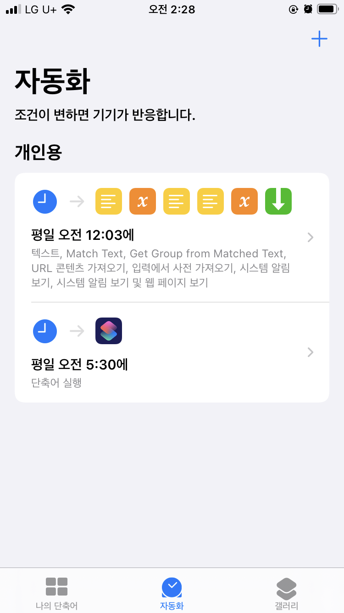
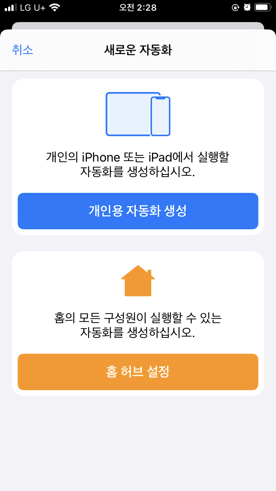
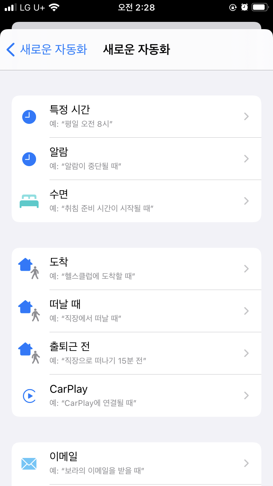
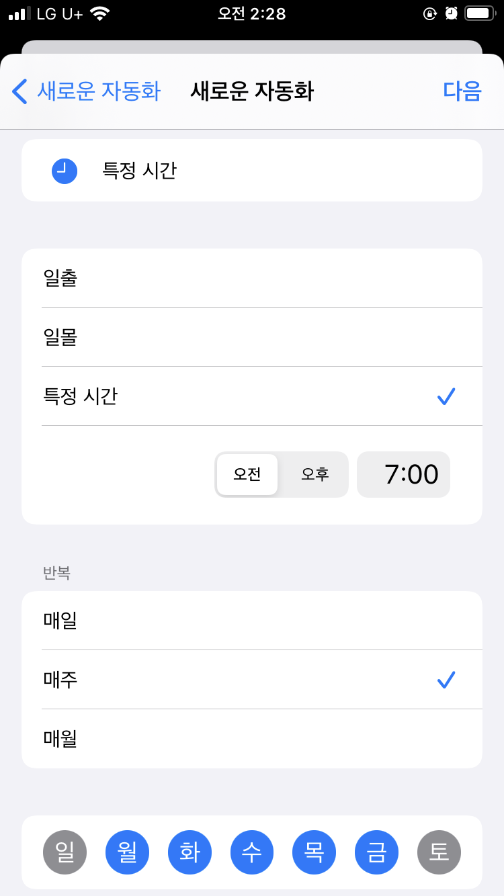
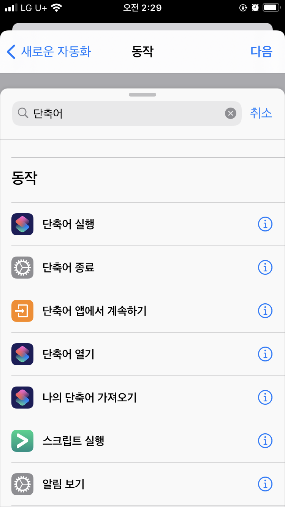
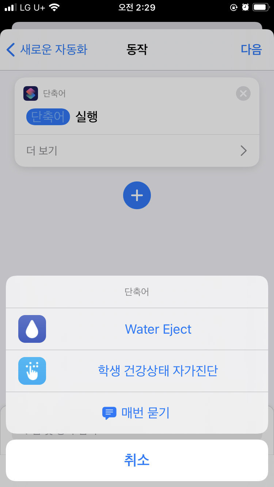
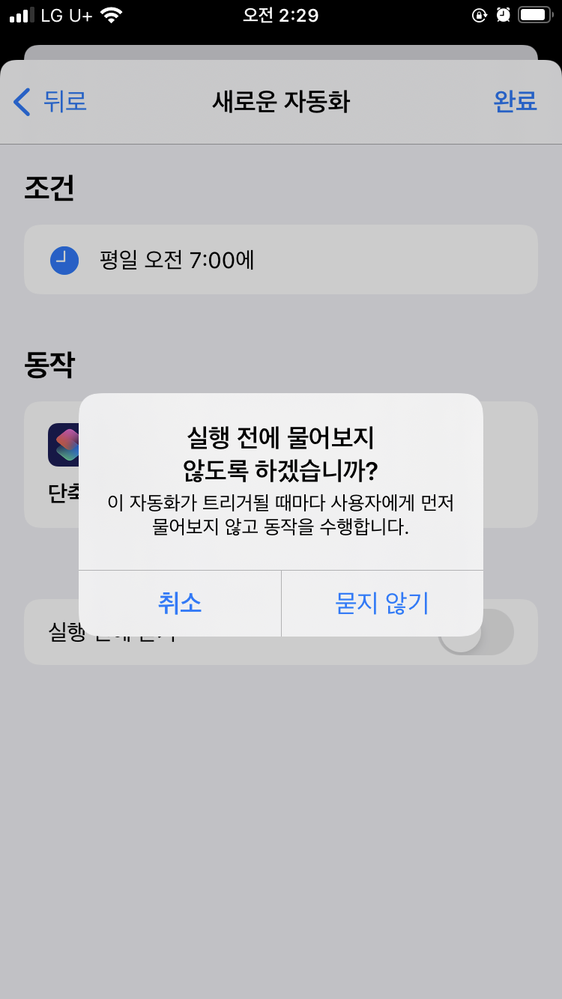

<p align="center">
  

  <h2 align="center">건강상태 자가진단 단축어 for iOS</h2>
</p>

### 다운로드

**Safari**를 통해 아래 링크를 열어주세요

<a href="https://www.icloud.com/shortcuts/bfe702a5bd984d948f0d1f158f30a89b">단축어 다운로드</a>

### 단축어 기본 설정

아래와 같은 형식으로 되어있는 텍스트를 본인의 정보에 맞게 수정합니다.

교육청 코드를 모르는 경우 [이곳](#교육청-코드)으로 이동합니다.

기관 코드를 모르는 경우 [이곳](#기관-코드)으로 이동합니다.

비밀번호는 자가진단 애플리케이션 혹은 사이트에서 설정한 4자리 숫자입니다.
```
교육청코드:기관코드:이름:생년월일:비밀번호
```
> 입력 예시
```
goe:J100000000:홍길동:991217:0000
```

### 자동화(선택)

|                   |                   |                   |                   |                   |                   |                   |
| :---------------: | :---------------: | :---------------: | :---------------: | :---------------: | :---------------: | :---------------: |
|  |  |  |  |  |  |  |

### 참고 사항

- 이 단축어는 건강상의 이상이 없는 경우에만 사용해야 하며 만일 그렇지 않은 경우 직접 자가 진단을 진행해야 합니다.

  이 단축어를 사용하여 발생할 수 있는 문제에 대한 책임은 사용자에게 있습니다.

### 릴리즈 노트

**20210730** - 자가진단 로직 변경 대응

**20210430** - 기관 코드 조회 방식 변경

**20201212** - 자가진단 로직 변경 대응, 비밀번호 인증 추가

**20201206** - 자가진단 서비스 신규기능 적용 업데이트로 인한 로직 변경 대응

**20201107** - 자가진단 v2 대응 업데이트, 자가 진단 결과 표기에 이름 누락된 부분 수정, 경기도 외 타 지역 지원 추가

**20200909** - 초기 릴리즈

#### 교육청 코드

| 지역           | 코드 |
| :------------- | :--- |
| 서울특별시     | sen  |
| 경기도         | goe  |
| 강원도         | kwe  |
| 충청북도       | cbe  |
| 충청남도       | cne  |
| 전라북도       | jbe  |
| 전라남도       | jne  |
| 경상북도       | gbe  |
| 경상남도       | gne  |
| 부산광역시     | pen  |
| 광주광역시     | gen  |
| 울산광역시     | use  |
| 대전광역시     | dje  |
| 인천광역시     | ice  |
| 대구광역시     | dge  |
| 제주특별자치도 | jje  |

#### 기관 코드

[이곳](https://neis.chemistryx.me)에서 찾고자 하는 기관의 코드를 조회하실 수 있습니다.
